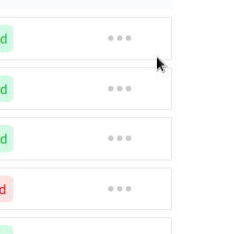

# React OverlayMenu

## Demo


## Usage
This module is to create an overlay type of menus with an auto cancellation feature. You can create your own menu design and then just wrap that menu with this OverlayMenu component and pass the values `visible, setVisible` state and `container_ref` this will be ref to your menu container to work auto-cancel feature properly.


You can create your custom modal, menu, dropdowns, and more with this package. Overlaymenu will be disappeared if you click outside of the menu or press the ESC key on the keyboard.

### Installation
Run the following command in your terminal to install the package
```sh
npm i overlaymenu
```

### Importing
You can import the component as shown below.
```javascript
import OverlayMenu from "overlaymenu";
```

### Using the Component
You can use the component as shown below. just wrap your menu or dialog with OverlayMenu Component and pass the props visible,setVisible and container_ref. container_ref is the ref of your exact dialog or menu element/component.

### Here is code example:

```javascript
function App() {
  const [visible, setvisible] = useState(false);
  const container_ref = useRef();

  return (
    <div>
      <div ref={container_ref}>
        <h1 onClick={() => setvisible(!visible)}>Menu</h1>
        <OverlayMenu
          container_ref={container_ref}
          visible={visible}
          setVisible={setvisible}
        >
          <div>
            <div>item</div>
            <div>item2</div>
            <div>item3</div>
          </div>
        </OverlayMenu>
      </div>
    </div>
  );
}
```

## Development and Contributing
To get started

- Fork and clone this repo
- Install the dependencies with npm or pnpm
- Start development server with npm start. This will launch a preview screen. Open a browser to http://localhost:3000 to preview the React Component.
- Use CTRL-C to exit the preview.
- Use npm run build to generate the compiled component for publishing to npm.

Feel free to open an issue, submit a pull request, or contribute however you would like. Understand that this documentation is still a work in progress, so file and issue or submit a PR to ask questions or make imporvements. Thanks!
